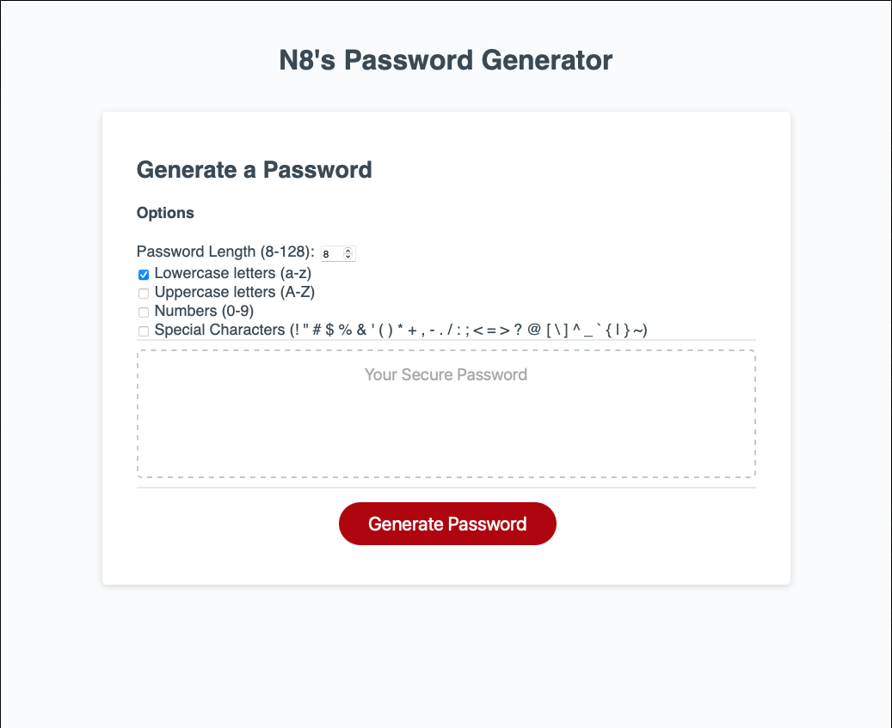

# PasswordGenerator
A Simple web-based password generator.

## Instructions

Select options from the presented web form and click generat! The password box will be filled with a random password in accordance with the parameters specified. 

Passwords can be:
- 8 to 128 character
- contain a combination of lowercase, uppercase, numbers and/or special characters

## Process

In the javascript portion of the password generator I wanted to imploy the use of a range-like data structure, which I implimented with a function that returns an array from two given charaters, which are the lower and upper bounds of the range. 

## In Action

You can see this project live at: <a href="https://n8blake.github.io/PasswordGenerator/">https://n8blake.github.io/PasswordGenerator/</a>

